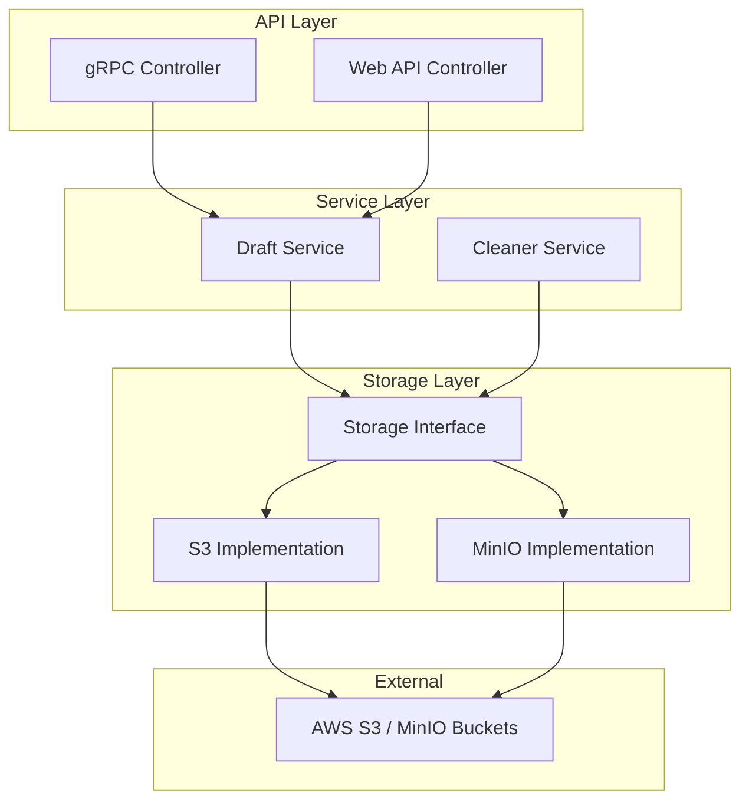
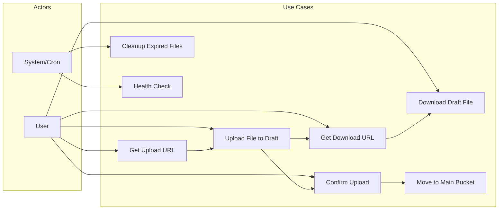
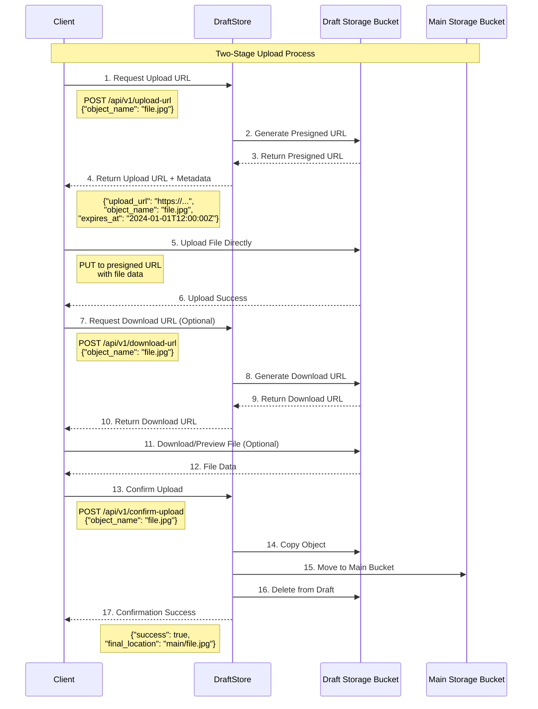
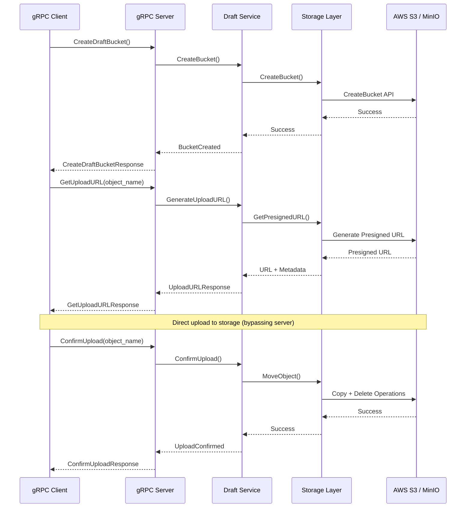
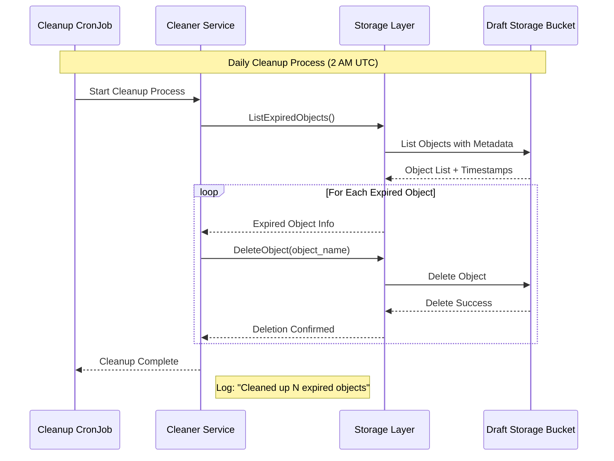
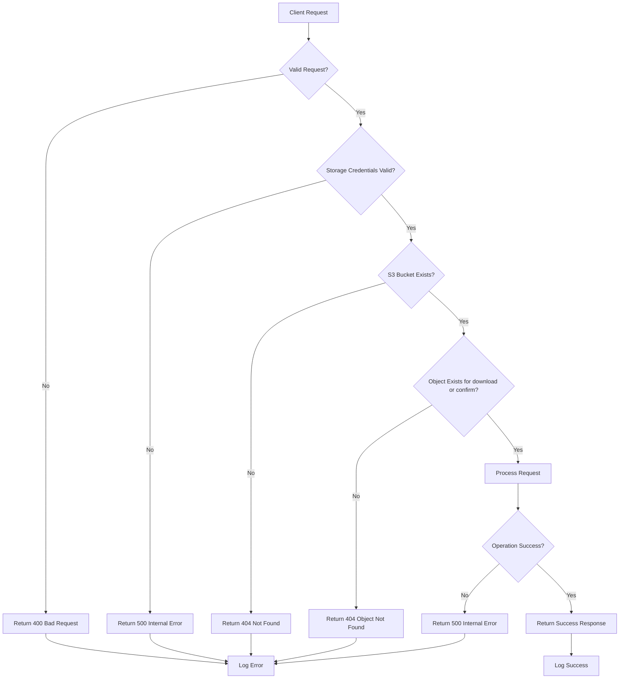
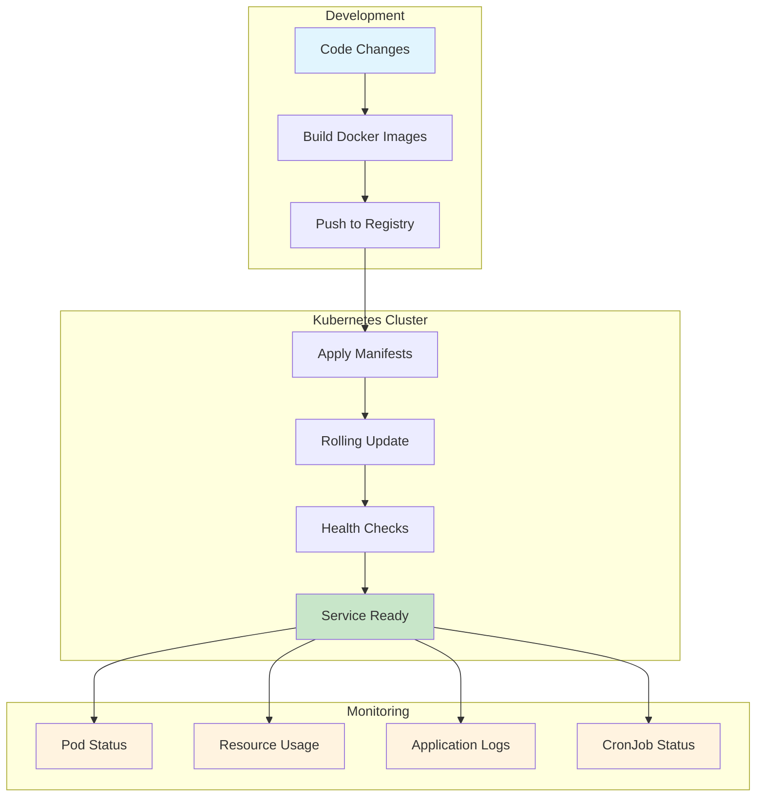

# DraftStore

DraftStore is a cloud-native file upload service that provides a two-stage upload mechanism using draft and main buckets. It's designed for scenarios where you need to upload files temporarily before confirming their final placement.

## 🏗️ Architecture

### Component Architecture



### Use Case Diagram



### Project Structure

```
DraftStore/
├── proto/                     # Protocol Buffer definitions
│   └── draft/v1/
│       └── draft.proto       # gRPC service definitions
├── gen/                      # Generated code
├── lib/                      # Core library components
│   ├── storage/             # Storage abstraction layer
│   │   ├── s3/             # AWS S3 implementation
│   │   └── minio/          # MinIO implementation
│   ├── service/            # Business logic services
│   │   ├── draft/          # Draft upload service
│   │   └── cleaner/        # Cleanup service
│   └── controller/         # API controllers
│       ├── grpc/           # gRPC server implementation
│       └── webapi/         # REST API implementation
├── cmd/                     # Application entry points
│   ├── server/             # Main server (gRPC + HTTP)
│   └── cronjob/            # Cleanup cronjob
├── manifest/               # Kubernetes manifests
├── buf.yaml                # Buf configuration
├── buf.gen.yaml            # Code generation configuration
└── go.mod                  # Go module dependencies
```

### Core Components

#### 1. Storage Layer (`lib/storage/`)
- **Interface**: Abstract storage interface for cloud provider flexibility
- **S3 Implementation**: AWS S3-specific implementation with presigned URLs
- **MinIO Implementation**: MinIO-compatible implementation with presigned URLs
- **Operations**: Bucket management, object operations, cleanup

#### 2. Services (`lib/service/`)
- **Draft Service**: Manages two-stage upload workflow
- **Cleaner Service**: Handles automatic cleanup of expired draft objects

#### 3. API Layer (`lib/controller/`)
- **gRPC Server**: High-performance binary protocol
- **Web API Server**: RESTful HTTP API for web clients

#### 4. Applications (`cmd/`)
- **Server**: Combined gRPC and HTTP server
- **Cronjob**: Kubernetes Job for periodic cleanup

## 🚀 Features

- **Two-Stage Upload**: Upload to draft bucket, then confirm to move to main bucket
- **Presigned URLs**: Secure direct-to-storage uploads without proxying files
- **Automatic Cleanup**: Configurable cleanup of expired draft objects
- **Dual APIs**: Both gRPC and REST APIs available
- **Cloud Native**: Designed for Kubernetes deployment
- **Storage Agnostic**: Interface-based design supports both AWS S3 and MinIO backends

## 📊 Workflow Diagrams

### Complete Upload Workflow



### gRPC Workflow



### Cleanup Process



### Error Handling Flow



### Deployment Flow



## 📋 Prerequisites

- Go 1.24.4+
- AWS Account with S3 access OR MinIO server
- Docker (for containerized deployment)
- Kubernetes cluster (for production deployment)
- Buf CLI (for protocol buffer generation)

## 🛠️ Installation

### Local Development

1. **Clone the repository**
   ```bash
   git clone https://github.com/snowmerak/DraftStore.git
   cd DraftStore
   ```

2. **Install dependencies**
   ```bash
   go mod download
   ```

3. **Generate code from protobuf**
   ```bash
   go tool buf generate
   ```

4. **Set up storage credentials**

   **For AWS S3:**
   ```bash
   export AWS_ACCESS_KEY_ID=your-access-key
   export AWS_SECRET_ACCESS_KEY=your-secret-key
   export AWS_REGION=us-east-1
   export STORAGE_TYPE=s3
   ```

   **For MinIO:**
   ```bash
   export MINIO_ENDPOINT=localhost:9000
   export MINIO_ACCESS_KEY=minioadmin
   export MINIO_SECRET_KEY=minioadmin
   export MINIO_USE_SSL=false
   export MINIO_REGION=us-east-1
   export STORAGE_TYPE=minio
   ```

5. **Configure environment variables**
   ```bash
   export BUCKET_NAME=your-main-bucket
   export GRPC_PORT=50051
   export HTTP_PORT=8080
   export UPLOAD_TTL=3600    # 1 hour
   export DOWNLOAD_TTL=3600  # 1 hour
   ```

6. **Run the server**
   ```bash
   go run cmd/server/main.go
   ```

### MinIO Local Development Setup

If you want to develop locally with MinIO instead of AWS S3, you can run MinIO in a Docker container:

1. **Start MinIO server**
   ```bash
   docker run -d \
     -p 9000:9000 \
     -p 9001:9001 \
     --name minio \
     -e "MINIO_ROOT_USER=minioadmin" \
     -e "MINIO_ROOT_PASSWORD=minioadmin" \
     -v /tmp/minio-data:/data \
     minio/minio server /data --console-address ":9001"
   ```

2. **Access MinIO Console**
   - Open http://localhost:9001 in your browser
   - Login with username: `minioadmin`, password: `minioadmin`
   - Create buckets as needed

3. **Configure environment for MinIO**
   ```bash
   export STORAGE_TYPE=minio
   export MINIO_ENDPOINT=localhost:9000
   export MINIO_ACCESS_KEY=minioadmin
   export MINIO_SECRET_KEY=minioadmin
   export MINIO_USE_SSL=false
   export BUCKET_NAME=main
   ```

4. **Stop MinIO server**
   ```bash
   docker stop minio
   docker rm minio
   ```

### Building Binaries

```bash
# Build server
go build -o bin/server cmd/server/main.go

# Build cronjob
go build -o bin/cronjob cmd/cronjob/main.go
```

## 🐳 Docker Deployment

### Build Docker Images

```dockerfile
# Dockerfile.server
FROM golang:1.24.4-alpine AS builder
WORKDIR /app
COPY go.mod go.sum ./
RUN go mod download
COPY . .
RUN go build -o server cmd/server/main.go

FROM alpine:latest
RUN apk --no-cache add ca-certificates
WORKDIR /root/
COPY --from=builder /app/server .
CMD ["./server"]
```

```dockerfile
# Dockerfile.cronjob
FROM golang:1.24.4-alpine AS builder
WORKDIR /app
COPY go.mod go.sum ./
RUN go mod download
COPY . .
RUN go build -o cronjob cmd/cronjob/main.go

FROM alpine:latest
RUN apk --no-cache add ca-certificates
WORKDIR /root/
COPY --from=builder /app/cronjob .
CMD ["./cronjob"]
```

### Build and Push

```bash
# Build images
docker build -f Dockerfile.server -t your-registry/draftstore-server:latest .
docker build -f Dockerfile.cronjob -t your-registry/draftstore-cronjob:latest .

# Push to registry
docker push your-registry/draftstore-server:latest
docker push your-registry/draftstore-cronjob:latest
```

## ☸️ Kubernetes Deployment

### 1. ConfigMap for Configuration

```yaml
# config/configmap.yaml
apiVersion: v1
kind: ConfigMap
metadata:
  name: draftstore-config
  namespace: draftstore
data:
  BUCKET_NAME: "main"
  AWS_REGION: "us-east-1"
  GRPC_PORT: "50051"
  HTTP_PORT: "8080"
  UPLOAD_TTL: "3600"
  DOWNLOAD_TTL: "3600"
  OBJECT_LIFETIME: "86400"  # 24 hours
```

### 2. Secret for Storage Credentials

**For AWS S3:**
```yaml
# config/secret-aws.yaml
apiVersion: v1
kind: Secret
metadata:
  name: storage-credentials
  namespace: draftstore
type: Opaque
data:
  STORAGE_TYPE: czM=  # base64 for "s3"
  AWS_ACCESS_KEY_ID: <base64-encoded-access-key>
  AWS_SECRET_ACCESS_KEY: <base64-encoded-secret-key>
```

**For MinIO:**
```yaml
# config/secret-minio.yaml
apiVersion: v1
kind: Secret
metadata:
  name: storage-credentials
  namespace: draftstore
type: Opaque
data:
  STORAGE_TYPE: bWluaW8=  # base64 for "minio"
  MINIO_ENDPOINT: <base64-encoded-endpoint>
  MINIO_ACCESS_KEY: <base64-encoded-access-key>
  MINIO_SECRET_KEY: <base64-encoded-secret-key>
  MINIO_USE_SSL: ZmFsc2U=  # base64 for "false"
  MINIO_REGION: dXMtZWFzdC0x  # base64 for "us-east-1"
```

### 3. Deployment for Server

```yaml
# deploy/deployment.yaml
apiVersion: apps/v1
kind: Deployment
metadata:
  name: draftstore-server
  namespace: draftstore
spec:
  replicas: 3
  selector:
    matchLabels:
      app: draftstore-server
  template:
    metadata:
      labels:
        app: draftstore-server
    spec:
      containers:
      - name: server
        image: your-registry/draftstore-server:latest
        ports:
        - containerPort: 50051
          name: grpc
        - containerPort: 8080
          name: http
        envFrom:
        - configMapRef:
            name: draftstore-config
        - secretRef:
            name: storage-credentials
        resources:
          requests:
            memory: "128Mi"
            cpu: "100m"
          limits:
            memory: "512Mi"
            cpu: "500m"
        livenessProbe:
          httpGet:
            path: /health
            port: 8080
          initialDelaySeconds: 30
          periodSeconds: 10
        readinessProbe:
          httpGet:
            path: /health
            port: 8080
          initialDelaySeconds: 5
          periodSeconds: 5
```

### 4. Service for Load Balancing

```yaml
# deploy/service.yaml
apiVersion: v1
kind: Service
metadata:
  name: draftstore-service
  namespace: draftstore
spec:
  selector:
    app: draftstore-server
  ports:
  - name: grpc
    port: 50051
    targetPort: 50051
  - name: http
    port: 80
    targetPort: 8080
  type: LoadBalancer
```

### 5. CronJob for Cleanup

```yaml
# deploy/cronjob.yaml
apiVersion: batch/v1
kind: CronJob
metadata:
  name: draftstore-cleanup
  namespace: draftstore
spec:
  schedule: "0 2 * * *"  # Daily at 2 AM
  jobTemplate:
    spec:
      template:
        spec:
          containers:
          - name: cleanup
            image: your-registry/draftstore-cronjob:latest
            envFrom:
            - configMapRef:
                name: draftstore-config
            - secretRef:
                name: storage-credentials
            resources:
              requests:
                memory: "64Mi"
                cpu: "50m"
              limits:
                memory: "256Mi"
                cpu: "200m"
          restartPolicy: OnFailure
```

### 6. Deploy to Kubernetes

```bash
# Create namespace
kubectl create namespace draftstore

# Apply configurations
kubectl apply -f config/
kubectl apply -f deploy/

# Check deployment status
kubectl get pods -n draftstore
kubectl get services -n draftstore
kubectl get cronjobs -n draftstore
```

### 7. MinIO in Kubernetes (Alternative to AWS S3)

If you prefer to run MinIO within your Kubernetes cluster instead of using AWS S3:

**MinIO Deployment:**
```yaml
# deploy/minio-deployment.yaml
apiVersion: apps/v1
kind: Deployment
metadata:
  name: minio
  namespace: draftstore
spec:
  replicas: 1
  selector:
    matchLabels:
      app: minio
  template:
    metadata:
      labels:
        app: minio
    spec:
      containers:
      - name: minio
        image: minio/minio:latest
        command:
        - /bin/bash
        - -c
        args:
        - minio server /data --console-address :9001
        env:
        - name: MINIO_ROOT_USER
          value: "minioadmin"
        - name: MINIO_ROOT_PASSWORD
          value: "minioadmin"
        ports:
        - containerPort: 9000
        - containerPort: 9001
        volumeMounts:
        - name: data
          mountPath: /data
      volumes:
      - name: data
        emptyDir: {}
---
apiVersion: v1
kind: Service
metadata:
  name: minio-service
  namespace: draftstore
spec:
  selector:
    app: minio
  ports:
  - name: api
    port: 9000
    targetPort: 9000
  - name: console
    port: 9001
    targetPort: 9001
  type: ClusterIP
```

**Deploy MinIO:**
```bash
kubectl apply -f deploy/minio-deployment.yaml

# Check MinIO status
kubectl get pods -l app=minio -n draftstore
```

**Update storage credentials for MinIO:**
```bash
# Create MinIO credentials secret
kubectl create secret generic storage-credentials \
  --from-literal=STORAGE_TYPE=minio \
  --from-literal=MINIO_ENDPOINT=minio-service:9000 \
  --from-literal=MINIO_ACCESS_KEY=minioadmin \
  --from-literal=MINIO_SECRET_KEY=minioadmin \
  --from-literal=MINIO_USE_SSL=false \
  --from-literal=MINIO_REGION=us-east-1 \
  -n draftstore
```

### 8. Verify and Test

After deployment, verify that all components are running correctly:

```bash
# Check all pods
kubectl get pods -n draftstore

# Check services
kubectl get services -n draftstore

# Check cronjobs
kubectl get cronjobs -n draftstore

# Test gRPC and HTTP APIs
# (use appropriate client or curl commands)
```

## 🔧 Configuration

### Environment Variables

| Variable | Description | Default | Required |
|----------|-------------|---------|----------|
| `STORAGE_TYPE` | Storage backend type (`s3` or `minio`) | `s3` | ✅ |
| `BUCKET_NAME` | Main bucket name | `main` | ✅ |
| **AWS S3 Configuration** |
| `AWS_REGION` | AWS region | `us-east-1` | ✅ (for S3) |
| `AWS_ACCESS_KEY_ID` | AWS access key | - | ✅ (for S3) |
| `AWS_SECRET_ACCESS_KEY` | AWS secret key | - | ✅ (for S3) |
| **MinIO Configuration** |
| `MINIO_ENDPOINT` | MinIO server endpoint | `localhost:9000` | ✅ (for MinIO) |
| `MINIO_ACCESS_KEY` | MinIO access key | `minioadmin` | ✅ (for MinIO) |
| `MINIO_SECRET_KEY` | MinIO secret key | `minioadmin` | ✅ (for MinIO) |
| `MINIO_USE_SSL` | Use SSL for MinIO connection | `false` | ❌ (for MinIO) |
| `MINIO_REGION` | MinIO region | `us-east-1` | ❌ (for MinIO) |
| **Server Configuration** |
| `GRPC_PORT` | gRPC server port | `50051` | ❌ |
| `HTTP_PORT` | HTTP server port | `8080` | ❌ |
| `UPLOAD_TTL` | Upload URL TTL (seconds) | `3600` | ❌ |
| `DOWNLOAD_TTL` | Download URL TTL (seconds) | `3600` | ❌ |
| `OBJECT_LIFETIME` | Draft object lifetime (seconds) | `86400` | ❌ |

## 📊 Expected Behavior in Kubernetes

### Normal Operations

1. **Server Pods**: 3 replicas running for high availability
2. **Load Balancer**: Distributes traffic across server instances
3. **Health Checks**: Automatic pod restarts on failures
4. **Cleanup Job**: Runs daily to remove expired draft objects

### Scaling

```bash
# Scale up for high traffic
kubectl scale deployment draftstore-server --replicas=5 -n draftstore

# Horizontal Pod Autoscaler
kubectl autoscale deployment draftstore-server --cpu-percent=50 --min=3 --max=10 -n draftstore
```

### Monitoring

```bash
# Check logs
kubectl logs -f deployment/draftstore-server -n draftstore

# Check cronjob status
kubectl get jobs -n draftstore

# Monitor resource usage
kubectl top pods -n draftstore
```

## 🔌 API Usage

### gRPC API

```protobuf
service DraftService {
  rpc CreateDraftBucket(CreateDraftBucketRequest) returns (CreateDraftBucketResponse);
  rpc GetUploadURL(GetUploadURLRequest) returns (GetUploadURLResponse);
  rpc GetDownloadURL(GetDownloadURLRequest) returns (GetDownloadURLResponse);
  rpc ConfirmUpload(ConfirmUploadRequest) returns (ConfirmUploadResponse);
}
```

### REST API

```bash
# Get upload URL
curl -X POST http://localhost:8080/api/v1/upload-url \
  -H "Content-Type: application/json" \
  -d '{"object_name": "my-file.jpg"}'

# Get download URL
curl -X POST http://localhost:8080/api/v1/download-url \
  -H "Content-Type: application/json" \
  -d '{"object_name": "my-file.jpg"}'

# Confirm upload
curl -X POST http://localhost:8080/api/v1/confirm-upload \
  -H "Content-Type: application/json" \
  -d '{"object_name": "my-file.jpg"}'
```

## 🔍 Troubleshooting

### Common Issues

**General:**
1. **Storage Credentials**: Ensure proper credentials and permissions
2. **Bucket Names**: Must be globally unique (for S3) or valid bucket names (for MinIO)
3. **Network Policies**: Ensure pods can reach storage endpoints
4. **Resource Limits**: Adjust based on traffic patterns

**AWS S3 Specific:**
1. **IAM Permissions**: Ensure proper IAM permissions for S3 operations:
   ```json
   {
     "Version": "2012-10-17",
     "Statement": [
       {
         "Effect": "Allow",
         "Action": [
           "s3:CreateBucket",
           "s3:GetObject",
           "s3:PutObject",
           "s3:DeleteObject",
           "s3:ListBucket"
         ],
         "Resource": [
           "arn:aws:s3:::your-bucket-name",
           "arn:aws:s3:::your-bucket-name/*"
         ]
       }
     ]
   }
   ```

**MinIO Specific:**
1. **Endpoint Configuration**: Ensure MinIO endpoint is accessible from pods
2. **SSL Configuration**: Set `MINIO_USE_SSL=false` for non-HTTPS MinIO
3. **Service Discovery**: Use service names for in-cluster MinIO (e.g., `minio-service:9000`)
4. **Bucket Creation**: MinIO may require manual bucket creation via console

**Storage Type Configuration:**
- Ensure `STORAGE_TYPE` environment variable is set to either `s3` or `minio`
- Verify that the appropriate credentials are provided for the selected storage type

### Debug Commands

```bash
# Check pod logs
kubectl logs -l app=draftstore-server -n draftstore

# Check cronjob history
kubectl get jobs -n draftstore

# Test application health
kubectl exec -it deployment/draftstore-server -n draftstore -- wget -O- http://localhost:8080/health

# For MinIO debugging
# Check MinIO pod status
kubectl get pods -l app=minio -n draftstore

# Check MinIO logs
kubectl logs -l app=minio -n draftstore

# Test MinIO connectivity from DraftStore pod
kubectl exec -it deployment/draftstore-server -n draftstore -- nc -zv minio-service 9000

# Access MinIO console (if using port-forward)
kubectl port-forward service/minio-service 9001:9001 -n draftstore
# Then open http://localhost:9001

# For AWS S3 debugging
# Test AWS credentials and S3 access
kubectl exec -it deployment/draftstore-server -n draftstore -- env | grep AWS

# Check storage configuration
kubectl get secret storage-credentials -n draftstore -o yaml
```

## 📊 Storage Backend Comparison

### AWS S3 vs MinIO

| Feature | AWS S3 | MinIO |
|---------|--------|-------|
| **Deployment** | Managed service | Self-hosted |
| **Cost** | Pay-per-use | Infrastructure costs only |
| **Scalability** | Unlimited | Limited by hardware |
| **Durability** | 99.999999999% (11 9's) | Depends on setup |
| **Availability** | 99.99% SLA | Depends on setup |
| **Geographic Distribution** | Multiple regions/AZs | Single cluster |
| **Compliance** | SOC, PCI, HIPAA, etc. | Self-managed |
| **Setup Complexity** | Minimal (credentials only) | Moderate (deployment required) |
| **Development** | Requires AWS account | Local development friendly |
| **Backup/DR** | Built-in features | Manual configuration |

### When to Choose AWS S3
- Production environments requiring high availability
- Applications with unpredictable storage needs
- Compliance requirements (healthcare, finance)
- Global distribution requirements
- Minimal operational overhead preferred

### When to Choose MinIO
- Development and testing environments
- On-premises or private cloud deployments
- Cost-sensitive applications with predictable usage
- Air-gapped or restricted network environments
- Full control over data locality required
- Learning S3 API without AWS costs
